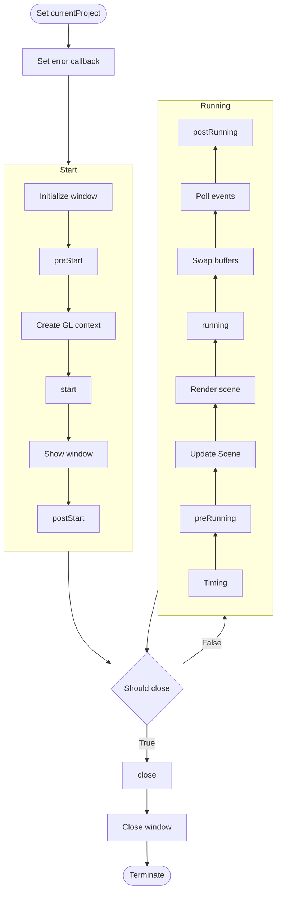
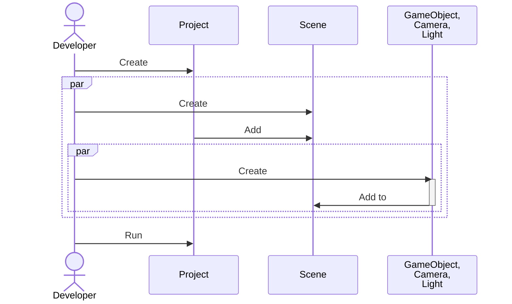

# Structure

## Startup Sequence

```mermaid
flowchart TB
subgraph Start
    direction TB
    init[Initialize window] --> preStart --> initCtx[Create GL context] --> start -->
    show[Show window] --> postStart
end
subgraph Running
    direction BT
    Timing --> preRunning --> update[Update Scene] --> render[Render scene] -->
    running --> swap[Swap buffers] --> poll[Poll events] --> postRunning
end
currProj([Set currentProject]) --> errorCb[Set error callback] --> Start -->
shouldClose{Should close} -->|False| Running --> shouldClose
shouldClose -->|True| close --> closeWindow[Close window] --> terminate([Terminate])
```

## Engine Sequence

```mermaid
sequenceDiagram
    actor Developer
    participant Project
    participant Scene
    participant obj as GameObject,<br> Camera,<br> Light
    Developer->>Project: Create
    par
        Developer->>Scene: Create
        Project->>Scene: Add
        par
            Developer->>obj: Create
            activate obj
            obj->>Scene: Add to
            deactivate obj
        end
    end
    Developer->>Project: Run
```
