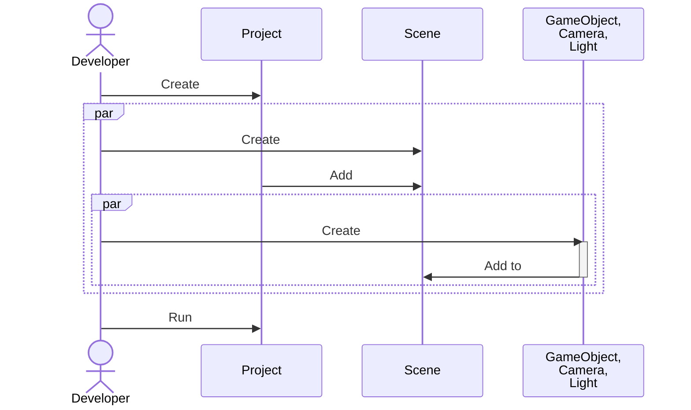

# Structure

## Engine Sequence

```mermaid
sequenceDiagram
    actor Developer
    participant Project
    participant Scene
    participant obj as GameObject,<br> Camera,<br> Light
    Developer->>Project: Create
    par
        Developer->>Scene: Create
        Project->>Scene: Add
        par
            Developer->>obj: Create
            activate obj
            obj->>Scene: Add to
            deactivate obj
        end
    end
    Developer->>Project: Run
```
